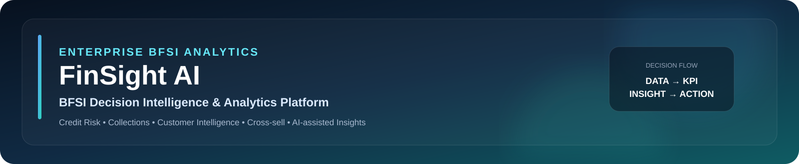

<div align="center">

<div align="center">



<br/>

[](#)
[](#)
[](#)
[](#)
[](#)
[](#)

<br/>

[](#)
[](#)
[](#)
[](#)

</div>

> **Enterprise-grade BFSI Analytics · Credit Risk · Collections · Customer Intelligence**
> 
> *Turning raw lending data into actionable portfolio decisions — end-to-end.*

<br/>

[🚀 Quick Start](#-quick-start) &nbsp;|&nbsp; [📐 Architecture](#-solution-architecture) &nbsp;|&nbsp; [📊 KPI Framework](#-core-kpi-framework) &nbsp;|&nbsp; [🤖 AI Copilot](#-ai-insight-copilot) &nbsp;|&nbsp; [💼 Interview Pitch](#-interview-pitch)

</div>

---

## 🏦 What is FinSight AI?

**FinSight AI** is a synthetic BFSI Decision Intelligence platform that simulates how a **retail bank or NBFC** can unify:

| Data Domain | Coverage |
|---|---|
| 👤 **Customers** | Demographics, geography, segmentation |
| 💳 **Loans** | AUM, disbursals, DPD, risk exposure |
| 💰 **Repayments** | Collection efficiency, collection gap |
| 📲 **Transactions** | Customer engagement, activity signals |
| 🛡️ **Insurance** | Cross-sell penetration, whitespace analysis |

…into one **analytical workflow** covering Portfolio Management, Credit Risk, Collections, Customer Intelligence, and Cross-sell Decisions.

```
Business Problem → Data → Analysis → KPI → Visualization → Insight → Action
```

> ⚠️ **Disclaimer:** All datasets are **synthetic**. For portfolio & learning purposes only. Not real banking performance.

---

## 💼 Business Problems Solved

<table>
<thead>
<tr>
<th>💬 Business Question</th>
<th>📌 Analytical Domain</th>
<th>🔑 Key Metric</th>
</tr>
</thead>
<tbody>
<tr><td>How large is the active portfolio?</td><td>Portfolio Management</td><td>AUM, Disbursals</td></tr>
<tr><td>Which products drive AUM concentration?</td><td>Portfolio Mix</td><td>Product-level AUM %</td></tr>
<tr><td>Where is delinquency concentrated?</td><td>Credit Risk</td><td>Delinquency Rate, DPD</td></tr>
<tr><td>Which accounts need collection priority?</td><td>Collections</td><td>Collection Gap, Efficiency</td></tr>
<tr><td>Which customers show product whitespace?</td><td>Customer Intelligence</td><td>Product Penetration</td></tr>
<tr><td>Where are insurance cross-sell opportunities?</td><td>Cross-sell</td><td>Cross-sell Rate</td></tr>
<tr><td>How can KPIs become management actions?</td><td>Decision Intelligence</td><td>AI Insight Narrative</td></tr>
</tbody>
</table>

---

## 🎯 What This Project Demonstrates

<table>
<tr>
<td width="50%">

**🏦 Portfolio Management**
- AUM and disbursal analysis
- Product concentration & mix
- Business KPI monitoring

**🔴 Credit Risk**
- DPD bucket analysis
- Delinquency monitoring
- 90+ DPD / NPL analytical proxy
- Product-level risk comparison

**🟢 Collections**
- Collection efficiency
- Collection gap analysis
- Priority account logic
- Recovery-focused recommendations

</td>
<td width="50%">

**🟣 Customer Intelligence**
- Customer segmentation
- Product penetration
- Transaction activity signals
- Customer value scoring

**🟠 Insurance Cross-sell**
- Insurance penetration rate
- Product whitespace identification
- Eligible customer opportunity

**🤖 AI-assisted Analytics**
- KPI interpretation
- Risk alerts & concentration insights
- Collection & cross-sell recommendations

</td>
</tr>
</table>

---

## 📐 Solution Architecture

```
╔══════════════════════════════════════════════════════════╗
║              🗃️  SYNTHETIC BFSI DATA                    ║
║   Customers │ Loans │ Repayments │ Transactions │ Insur. ║
╚════════════════════════╤═════════════════════════════════╝
                         │
                         ▼
╔══════════════════════════════════════════════════════════╗
║           🔍  DATA VALIDATION & PROFILING               ║
║   Schema • Duplicates • Missing • Range • Quality       ║
╚════════════════════════╤═════════════════════════════════╝
                         │
                         ▼
╔══════════════════════════════════════════════════════════╗
║           🗄️  ANALYTICS DATA LAYER                      ║
║              Raw → Staging → Marts                      ║
║                BigQuery-ready SQL                       ║
╚════════════════════════╤═════════════════════════════════╝
                         │
         ┌───────────────┼───────────────┐
         ▼               ▼               ▼
   ┌───────────┐   ┌──────────┐   ┌────────────┐
   │🐍 Python  │   │📊 R/SAS  │   │🔷 SQL/BQ   │
   │  EDA+KPI  │   │   Risk   │   │ KPI+Risk   │
   └─────┬─────┘   └────┬─────┘   └─────┬──────┘
         └───────────────┼───────────────┘
                         ▼
╔══════════════════════════════════════════════════════════╗
║              📊 BI / KPI LAYER                          ║
║              Power BI  •  Tableau                       ║
╚════════════════════════╤═════════════════════════════════╝
                         │
                         ▼
╔══════════════════════════════════════════════════════════╗
║          🖥️  FINSIGHT AI EXECUTIVE APP                  ║
║               Streamlit  •  Plotly                      ║
╚════════════════════════╤═════════════════════════════════╝
                         │
                         ▼
╔══════════════════════════════════════════════════════════╗
║              🤖 AI INSIGHT COPILOT                      ║
║       Deterministic Rules + Optional OpenAI             ║
╚════════════════════════╤═════════════════════════════════╝
                         │
                         ▼
              ┌─────────────────────┐
              │ ✅ Business Actions │
              └─────────────────────┘
```

---

## 🧰 Technology Stack

| Layer | Technology | Badge | Purpose |
|---|---|---|---|
| **Programming** | Python, Pandas, NumPy |  | Data preparation & analytics |
| **Querying** | SQL, BigQuery SQL |  | KPI, portfolio & risk analysis |
| **BI — Reporting** | Power BI |  | Business reporting & dashboards |
| **BI — Visual Analytics** | Tableau |  | Visual analytics layer |
| **Application** | Streamlit, Plotly |  | Interactive executive dashboard |
| **Statistics** | R, SAS |  | EDA & structured risk analysis |
| **Spreadsheet** | Advanced Excel |  | Reconciliation & analyst workflows |
| **AI Layer** | Deterministic + OpenAI |  | Management-ready insights |
| **Testing** | Pytest |  | Data-quality validation |
| **Version Control** | Git, GitHub |  | Source-code management |

---

## 📁 Project Structure

```
📦 BFSI-Lending-Risk-Intelligence-Platform/
│
├── 📂 app/
│   └── 🐍 app.py                    ← Streamlit Executive Dashboard
│
├── 📂 data/
│   ├── 📂 raw/
│   │   ├── 👤 customers.csv
│   │   ├── 💳 loans.csv
│   │   ├── 💰 repayments.csv
│   │   ├── 📲 transactions.csv
│   │   └── 🛡️ insurance_policies.csv
│   └── 📂 processed/
│       ├── 📊 customer_priority.csv
│       └── 📊 portfolio_by_state_product.csv
│
├── 📂 docs/
│   ├── 📄 INTERVIEW_STORY.md
│   └── 📄 SETUP.md
│
├── 📂 excel/
│   └── 📗 FinSight_BFSI_Analytics.xlsx
│
├── 📂 powerbi/
│   ├── 📄 README.md
│   └── 🖼️ screenshots/
│
├── 📂 python/
│   ├── 🐍 analysis.py
│   └── 🐍 generate_data.py
│
├── 📂 r/
│   └── 📊 eda.R
│
├── 📂 sas/
│   └── 📈 risk_analysis.sas
│
├── 📂 sql/
│   └── 📂 bigquery/
│       ├── 🔷 01_staging.sql
│       ├── 🔷 02_mart_portfolio.sql
│       ├── 🔷 03_kpi_queries.sql
│       ├── 🔷 04_credit_risk.sql
│       ├── 🔷 05_collections.sql
│       └── 🔷 06_customer_insurance.sql
│
├── 📂 tableau/
│   ├── 📄 README.md
│   └── 🖼️ screenshots/
│
├── 📂 tests/
│   └── 🧪 test_project.py
│
├── .gitignore
├── README.md
└── requirements.txt
```

---

## 🗃️ Data Model

<details>
<summary><b>👤 customers.csv — Customer Intelligence</b></summary>

<br/>

| Use Case | Fields Involved |
|---|---|
| 🗺️ Geography | State, region, branch |
| 🎯 Segmentation | Customer tier, profile |
| 📊 Demographic analysis | Age band, income |
| 🧠 Customer intelligence | Behavioural signals |

</details>

<details>
<summary><b>💳 loans.csv — Lending & Risk</b></summary>

<br/>

| Use Case | Fields Involved |
|---|---|
| 📦 Product analysis | Loan type, product |
| 💵 AUM | Outstanding principal |
| 📤 Disbursals | Original principal |
| ⚠️ DPD / risk analysis | Days past due, status |

</details>

<details>
<summary><b>💰 repayments.csv — Collections</b></summary>

<br/>

| Use Case | Fields Involved |
|---|---|
| 📅 Amount due | Due date, due amount |
| ✅ Amount paid | Payment date, paid amount |
| 📈 Collection efficiency | Paid / Due ratio |
| 🔴 Collection gap | Due − Paid |

</details>

<details>
<summary><b>📲 transactions.csv — Customer Activity</b></summary>

<br/>

| Use Case | Fields Involved |
|---|---|
| 🔄 Engagement analysis | Transaction frequency |
| 📊 Transaction behavior | Volume, channel |
| 🧩 Segmentation support | Activity bands |

</details>

<details>
<summary><b>🛡️ insurance_policies.csv — Cross-sell</b></summary>

<br/>

| Use Case | Fields Involved |
|---|---|
| 🛡️ Insurance penetration | Policy count vs eligible |
| 🔲 Product whitespace | No-policy active customers |
| 🎯 Cross-sell opportunity | Eligible + high-value filter |

</details>

---

## 📈 Core KPI Framework

| KPI | Formula | Business Purpose |
|---|---|---|
| 💵 **AUM** | `Σ Outstanding Principal` | Portfolio size |
| 📤 **Disbursals** | `Σ Original Principal` | Originations / lending volume |
| ⚠️ **Delinquency Rate** | `Overdue Active / Total Active` | Delinquency monitoring |
| 🔴 **NPL Proxy** | `DPD ≥ 90 Loans / Active Loans` | Analytical risk signal |
| ✅ **Collection Efficiency** | `Amount Collected / Amount Due` | Collections performance |
| 🛡️ **Cross-sell Rate** | `Active Insurance / Eligible Customers` | Insurance penetration |
| 📊 **Yield** | `Interest Income Proxy / Avg Outstanding` | Portfolio yield analysis |

> ⚠️ **NPL Proxy** is analytical only — not a regulatory NPA/NPL calculation.

---

## 🖥️ Executive Dashboard

The FinSight AI Streamlit app is designed as a **BFSI Executive Command Center** with five analytical modules:

```
┌─────────────────────────────────────────────────────────────┐
│  📊 EXECUTIVE OVERVIEW                                      │
│  AUM • Disbursals • Loan Count • Delinquency • NPL Proxy   │
│  Collection Efficiency • Portfolio Health • Concentration   │
├─────────────────────────────────────────────────────────────┤
│  🔴 CREDIT RISK                                             │
│  DPD Distribution • Risk Buckets • 90+ DPD Exposure        │
│  Product Risk Matrix • Risk Concentration                   │
├─────────────────────────────────────────────────────────────┤
│  🟢 COLLECTIONS                                             │
│  Collection Efficiency • Collection Gap                     │
│  Recovery Analysis • Priority Accounts                     │
├─────────────────────────────────────────────────────────────┤
│  🟣 CUSTOMER & INSURANCE                                    │
│  Customer Segments • Insurance Penetration                  │
│  Product Whitespace • Cross-sell Opportunities              │
├─────────────────────────────────────────────────────────────┤
│  🤖 AI INSIGHTS                                             │
│  Risk Alerts • Concentration Insights                       │
│  Collection Recommendations • Cross-sell Suggestions        │
└─────────────────────────────────────────────────────────────┘
```

---

## 🤖 AI Insight Copilot

The AI layer uses a **two-tier architecture** — fully functional without an API key:

```
  Filtered KPI / Analytical Context
               │
               ▼
    ┌─────────────────────────┐
    │  Deterministic Engine   │  ← Always-on, rule-based
    │  Risk Alerts            │
    │  Concentration Signals  │
    │  Collection Flags       │
    └──────────┬──────────────┘
               │
               ▼  (if OPENAI_API_KEY configured)
    ┌─────────────────────────┐
    │  Optional OpenAI Layer  │  ← Management narrative
    │  GPT-powered narrative  │
    └──────────┬──────────────┘
               │
               ▼
    Management-ready Insight
```

### 🛡️ AI Guardrails

| Rule | Why |
|---|---|
| 🚫 No customer PII sent to AI | Privacy & compliance |
| 📌 Insights grounded in KPI data | Factual accuracy |
| 👁️ Source values always visible | Transparency |
| ⚖️ Facts separated from recommendations | Decision-maker accountability |
| ⚠️ Synthetic data labelled clearly | Not real banking performance |

### 🔍 Example AI Signals → Management Actions

| Signal | 🎯 Recommended Action |
|---|---|
| 🔴 High 90+ DPD exposure | Prioritize high-risk products / segments |
| 🟦 High product concentration | Review alongside delinquency trends |
| 🟢 High collection gap | Focus recovery-targeted accounts |
| 🟣 Low insurance penetration | Target eligible high-value customers |

---

## 🧠 SQL / BigQuery Layer

```
Raw Data  →  Staging  →  Analytics Mart  →  KPI Queries  →  Risk / Collections
```

| File | Purpose |
|---|---|
| `🔷 01_staging.sql` | Staging layer — clean & type-cast raw data |
| `🔷 02_mart_portfolio.sql` | Portfolio analytics mart |
| `🔷 03_kpi_queries.sql` | KPI calculations |
| `🔷 04_credit_risk.sql` | Credit-risk analysis |
| `🔷 05_collections.sql` | Collections analysis |
| `🔷 06_customer_insurance.sql` | Customer + insurance analysis |

---

## 📊 Power BI & Tableau

### Power BI — Recommended Report Pages

```
Executive Overview → Credit Risk → Collections → Customer & Insurance → Cross-sell
```

**Visuals:** KPI Cards · Portfolio by Product · DPD Distribution · Risk Matrix · State Analysis · Collection Gap · Customer Segments

### Tableau — Suggested Views

- Portfolio Overview
- Product Risk Matrix
- DPD Distribution
- Collections Gap
- Insurance Penetration
- Geography / Branch Analysis

> 📁 Screenshots → `powerbi/screenshots/` & `tableau/screenshots/`

---

## 🧪 Data Quality & Testing

Automated Pytest validation covers:

| Check | Description |
|---|---|
| ✅ Required input files | All CSVs present |
| ✅ Required columns | Schema validation |
| ✅ Loan ID uniqueness | No duplicate keys |
| ✅ Non-negative DPD | Range validation |
| ✅ Monetary values | Non-negative check |
| ✅ Insurance flags | Valid flag values |
| ✅ Repayment fields | Completeness check |

---

## 🚀 Quick Start

```bash
# 1️⃣  Clone the repository
git clone https://github.com/mihirr00051/BFSI-Lending-Risk-Intelligence-Platform.git
cd BFSI-Lending-Risk-Intelligence-Platform

# 2️⃣  Create virtual environment
python -m venv .venv

# 3️⃣  Activate (Windows PowerShell)
.\.venv\Scripts\Activate.ps1

# 4️⃣  Install dependencies
pip install -r requirements.txt

# 5️⃣  Launch executive dashboard
python -m streamlit run .\app\app.py

# 6️⃣  Run analytics pipeline
python .\python\analysis.py

# 7️⃣  Run data-quality tests
python -m pytest -q
```

---

## ✅ Project Validation

| Check | Status |
|---|---|
| 🖥️ Streamlit dashboard | ✅ Done |
| 🐍 Python compile check | ✅ Done |
| 🧪 Data-quality / unit tests | ✅ Done |
| ⚠️ Synthetic data labelled | ✅ Done |
| 🔐 Secrets excluded from Git | ✅ Done |
| 🔷 SQL layer documented | ✅ Done |
| 📊 BI structure prepared | ✅ Done |
| 📄 Interview documentation | ✅ Done |
| 📸 Final Power BI screenshots | ⬜ Pending |
| 📸 Final Tableau screenshots | ⬜ Pending |

---

## 💼 Interview Pitch

### 🎤 30-Second Version

> *"FinSight AI is an end-to-end BFSI analytics platform I built to simulate a retail lending and customer-intelligence environment. I connected customer, loan, repayment, transaction, and insurance data; built SQL and Python analytics layers; added credit-risk and collections analysis; and exposed the final KPIs through an executive Streamlit dashboard with optional AI-assisted insights."*

---

### 🧠 Key Discussion Areas

| Topic | What to Say |
|---|---|
| **Why AUM matters** | Measures portfolio concentration and product-level exposure |
| **How DPD works** | Days Past Due — the primary credit-risk signal for delinquency monitoring |
| **Why 90+ DPD** | Used as an analytical NPL proxy; not regulatory NPA |
| **Collection efficiency** | Amount Collected ÷ Amount Due — measures recovery performance |
| **Collection priority** | Ranked by gap size and DPD bucket for field-team targeting |
| **Product whitespace** | Customers with active loans but no insurance = cross-sell pipeline |
| **Scalability path** | CSV analytics → BigQuery → dbt → Semantic layer → Power BI |

---

## ⚠️ Important Limitations

FinSight AI is a **portfolio simulation**, not a live banking platform.

| ❌ Do NOT present as | ✅ Accurate framing |
|---|---|
| Real customer performance | Synthetic simulation |
| Production underwriting | Analytical prototype |
| Regulatory NPA reporting | Analytical NPL proxy only |
| Real profitability | Illustrative yield analysis |
| Real-time banking data | Static synthetic dataset |

---

## 🔮 Production Roadmap

```
Kafka / CDC Ingestion
        ↓
Cloud Storage (GCS / S3)
        ↓
BigQuery Data Warehouse
        ↓
dbt Transformation Layer
        ↓
Semantic / Metric Layer
        ↓
Power BI / Tableau Reports
        ↓
ML-based Credit Risk Models
        ↓
LLM Insight Service (RAG)
        ↓
Monitoring & Governance
```

**Planned Enhancements**

- ☁️ Cloud-native ingestion pipeline
- 🔄 Incremental data processing
- 🌿 dbt transformation layer
- 🧩 Semantic data model
- 🤖 ML-based credit-risk scoring
- 📞 Advanced collections prioritization
- 💎 Customer lifetime-value analytics
- 🔐 Role-based access & security
- 📡 Production monitoring & alerting

---

## ⭐ Why This Project Matters

> The value is not the number of tools used.
> It is the **ability to convert a business problem into measurable decisions.**

```
Business Problem  →  Data  →  Validation  →  Analysis
        →  KPI  →  Visualization  →  Insight  →  Action
```

**That is the core analyst-to-decision workflow FinSight AI demonstrates.**

---

## 👨‍💻 Author

<div align="center">

### Mihirr Dobariya
**Data Analyst | Business Intelligence (BI) Analyst | Business Analyst**

[](https://linkedin.com/in/mihirr51)
[](https://github.com/mihirr00051)
[](mailto:mihirdobariyaofficial@gmail.com)

<br/>

*📍 Bengaluru, Karnataka, India*

</div>

---

## 📄 License

This project is released under the [MIT License](LICENSE).

---

<div align="center">


**⭐ Found this useful? Give it a star on GitHub!**

*Built with*     

</div>
